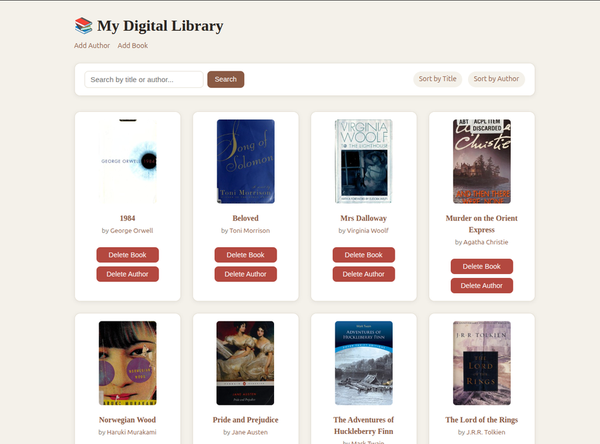
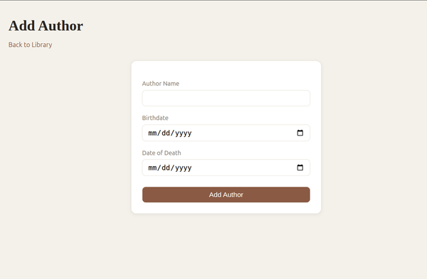
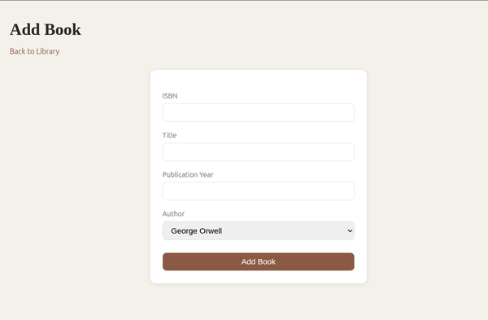

# Book Alchemy

A Flask web application for managing a personal digital library. Add authors and books, browse your collection with cover images, search and sort, view detail pages, and delete entries when needed.



## Features

- Add authors (name, birth date, date of death)
- Add books (ISBN, title, publication year, author)
- Browse all books on the home page, with cover images pulled from the Open Library Covers API
- Search books by title or author name
- Sort books by title or author name
- Detail pages for individual books and authors
- Delete a book (removes the author too if they have no other books left)
- Delete an author (removes all of their books)
- Friendly error pages for invalid input, missing records (404), and server errors (500)

## Requirements

- Python 3.14+
- [uv](https://docs.astral.sh/uv/) for dependency management

## Setup

1. Clone or download this project, then move into the project folder:

   ```bash
   cd book-alchemy
   ```

2. Install dependencies:

   ```bash
   uv sync
   ```

3. Create the database tables (only needed once, on first setup). Open `app.py`, uncomment the following block near the top:

   ```python
   with app.app_context():
       db.create_all()
   ```

   Run the app once to create `data/library.sqlite`, then comment the block out again.

## Running the app

```bash
uv run python app.py
```

The app runs on [http://localhost:5000](http://localhost:5000).

## Usage

### Add an author

Go to `/add_author`, fill in the form, and submit. Date of death is optional.



### Add a book

Go to `/add_book`, fill in ISBN, title, and publication year, and pick an author from the dropdown. At least one author must exist first.



### Browse your library

Go to `/home` to see all books as cards, with cover image, title, and author.

- **Search**: type into the search field and click "Search" to filter by title or author name.
- **Sort**: click "Sort by Title" or "Sort by Author" to reorder the results.
- **View details**: click a book cover/title or an author's name to open its detail page.
- **Delete a book**: click "Delete Book" on a book's card. If that was the author's last remaining book, the author is deleted too.
- **Delete an author**: click "Delete Author" on a book's card to remove the author and all of their books at once.

### Seed sample data

To quickly populate the library with 10 sample authors and books, run the app first, then in a separate terminal:

```bash
uv run python seed_data.py
```

This sends requests to the running app's `/add_author` and `/add_book` routes. By default it targets the URL set in `seed_data.py`; pass a different URL as an argument to target another instance instead:

```bash
uv run python seed_data.py http://localhost:5000
```

## Project structure

```text
book-alchemy/
├── app.py                  # Flask routes and app setup
├── data_models.py          # SQLAlchemy models (Author, Book)
├── seed_data.py            # Script to populate sample data
├── data/
│   └── library.sqlite      # SQLite database
├── static/
│   └── style.css           # App styling
└── templates/
    ├── home.html
    ├── add_author.html
    ├── add_book.html
    ├── book_detail.html
    ├── author_detail.html
    └── error.html
```

## Tech stack

- [Flask](https://flask.palletsprojects.com/)
- [Flask-SQLAlchemy](https://flask-sqlalchemy.palletsprojects.com/)
- SQLite
- Jinja2 templates
